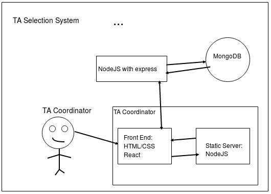

# Top Of The  Heap

### Members: 
Alex Yan, Atheed Thameem, Gabrielle Singh Cadieux, Janarthanan Manoharan, Sajid Ahmed, and Siddharth Gautam

# Architecture

## Applicant Side

### Technologies Used:
- HTML/CSS
- Materialize CSS
- React JS
- Node JS with Express
- MongoDB

### Explanation
The applicant interface of the TA Selection System will be using two web services to meet the requirements of the applicant. The user interface will be implememtented using React JS and the styling will be done with Materialize CSS, which smoothly integrates with React. The other aspect of the applicant interface is its backend. This includes serving static elements of the interface such as images, CSS files, Javascript files. While the static server will serve the front-end user interface aspects of the application, another backend server will be used, as well. This will be implemented using NodeJS, to accomplish any tasks that include communicating with the TA Coordinator side of the system.Such tasks include requests to access and modify data relevant to the applicant such as their personal and education information, which will be stored in the database. Furthermore, the backend is used to send completed TA applications so that they can viewed from the side of the TA-Coordinator.

#### Visual Representation of the Applicant Interface

# TA-Coordinator Side

### Technologies Used:
- HTML/CSS
- Materialize CSS
- React JS
- Node JS with Express
- MongoDB

### Explanation
Similar to the applicant interface, the TA-Coordinator side of the application will also be split into two seperate web services that will work together to facilitate the operations done by the TA-coordinator. The user interface will be implementented using React JS and the styling will be done with Materialize CSS. The other aspect of the TA Coordinator interface is its backend. This includes serving static elements of the interface such as images, CSS files, Javascript files. Another backend server will be used that is shared with the applicant side of the application. This server will take on the task of expediting requests to access and modify data relevant to the applicant such as their employment status and search for applicants from the database. MongoDB will be used to store all the information about the applicants. This includes their personal information, education information and applications.

#### Visual Representation of the TA-Coordinator Interface

# Visual Representation of the System

