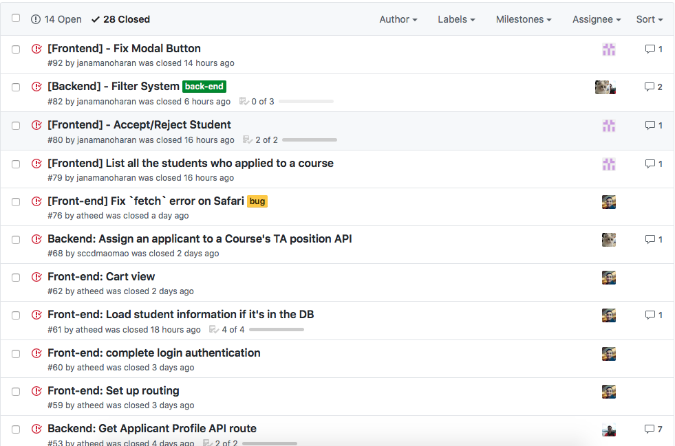
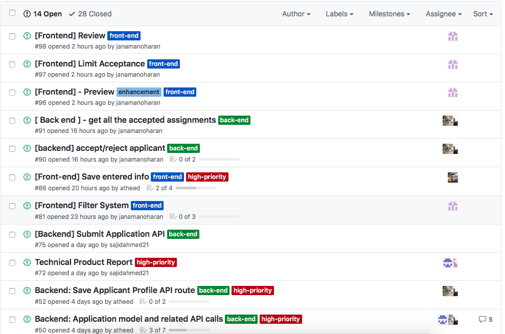

# Progress Report

## Intial Scope

Phase 2 was planned as our core developement phase. During this cycle, we planned to implement the base framework of our application that will enable us to build the features we mentioned in our initial [scope document]() in the previous phase. This includes setting up the projects and the dev environment for the different components of our app, designing and implementing the data model, and incorporating any new APIs that would be required by the client applications. In addition, we planned (and implemented) a sizeable subset of the features as mentioned in detail below.

## Tasks Completed
A significant portion of our entire application has been implemented during this phase. Apart from setting up the basic structures of the different components, we were able to implement the following set of features into our app:

* Applicant client:
    * User authentication
    * View list of courses with open TA positions
    * Mark courses interested in TAing, and rank them based on level of interest / preference
    * Ability to enter personal and academic information
    * Ability to add courses to a virtual cart, and revisit them with ease at a later time
    * Ability to save an incomplete application and resume editing at a later time

* TA Coordinator client:
    * View list of courses with open TA positions
    * View a list of applicants that applied to each course by clicking each course
    * Filter applicants based on their program level(Graduate Studies or Undergraduate)
    * Filter applicants based on whether they have TA'ed the course under consideration before
    * Ability to view an applicant's information such as their contact information, work status and work history
    * Ability to review all the assignments that have been made for each course

* Applicant System Backend:
    * [Design and implementation of database schema](https://github.com/csc302-2017-spring/proj-TopOfTheHeap/issues/22)
    * Following web APIs to support the above features of the Applicant and the TA Coordinator client:
   
     [Applicant Login](https://github.com/csc302-2017-spring/proj-TopOfTheHeap/issues/21), [GetAllApplicants](https://github.com/csc302-2017-spring/proj-TopOfTheHeap/issues/23), [GetCourses](https://github.com/csc302-2017-spring/proj-TopOfTheHeap/issues/30), [GetCourseInfo](https://github.com/csc302-2017-spring/proj-TopOfTheHeap/issues/31), [GetUnassignedPositions](https://github.com/csc302-2017-spring/proj-TopOfTheHeap/issues/38), [GetApplicantsByCourse](https://github.com/csc302-2017-spring/proj-TopOfTheHeap/issues/39), [GetApplicantProfile](https://github.com/csc302-2017-spring/proj-TopOfTheHeap/issues/53), [AssignApplicant](https://github.com/csc302-2017-spring/proj-TopOfTheHeap/issues/68), [FilterApplicants](https://github.com/csc302-2017-spring/proj-TopOfTheHeap/issues/82)
     
## Pending / Incomplete Tasks
Although we made significant inroads towards our final product, there are still outstanding features and some integration work left which we would have liked to complete within this phase. These are as follows:

* [API for saving applicant profile](https://github.com/csc302-2017-spring/proj-TopOfTheHeap/issues/52). This is only relevant for the non-academic information such as students' emails, degree status, etc, and their past history of TAing. This is *distinct* from the actual application for courses for TAing.
* [Apply consistent and usable design to all UI layouts](https://github.com/csc302-2017-spring/proj-TopOfTheHeap/issues/36)
* [Ability to mark an application as 'submitted'](https://github.com/csc302-2017-spring/proj-TopOfTheHeap/issues/75)

## Task(s) Not Part of Initial Scope
There is a particular enhancement that we added to our feature list, as we think this will add value to the user experience and will make the application process more comfortable and seemless.

* We introduced the concept of a "virtual cart", which will allow applicants to mark / shortlist courses they are interested in applying, so that can access / revisit them with ease at a later time.

# High-level Design
As mentioned in our [architecture document](../phase1/Arch.md) in Phase 1, our entire application is partitioned into three separate components: two client apps (i.e. the Applicant and the TA-Coordinator apps) and one central backend system.

Each client app is only responsible for providing an interface to its respective users. These applications do not persist or modify any data by themselves. They only call out APIs provided by the central backend system to retrieve or update relevant data.

The central backend system is regarded as a container / wrapper around the database instance, and is responsible for providing  an interface / gateway between client applications and the database instance.

Moreover, in order to decouple the implementation logic and to be consistent with general best practices, we have created separate modules pertaining to specific types of operations within each of these applications. We believe, this greatly helped in keeping our codebase organized and readable.

# Testing

For this phase, we relied largely on manual testing -- both on the front- and back-end. 

**Front-end**

For the front-end, as we built our various React components, we tested by visually asserting that each component rendered correctly, with the correct state variables, etc. We knew immediately, via this visual testing, when a component was rendering incorrectly, and could quickly and efficiently remedy the problem. We made liberal use of the various browsers' developer tools (for example [Chrome DevTools](https://developer.chrome.com/devtools) in this testing process, to examine and debug any errors that occurred on the front-end. 

Additionally, our applications make frequent use of `fetch()` calls to various API routes in the back-end. For this, before actually calling any route, we ensured that all the data we intended to send was well-formed (using, for example, Chrome DevTools). Then, we ensured that each `fetch()` call arrived correctly at each application's respective `server.js` file (by logging the body of the requests). Then, only once all of this was ensured to be correct, did we make the final API call, from the corresponding `server.js` to the main back-end server (in `dev/services/src/main.js`). 

**Back-end**

In the back-end, we made constant use of API testers/examiners such as [Postman](https://www.getpostman.com/docs/introduction). Whenever an API route was built, we checked, using Postman, that 1) the route is actually alive and is receiving requests, 2) that the route is actually responding with well-formed JSON objects, and 3) that the route is responding with accurate and expected information. Any time that any of these 3 conditions was not met, we knew about it immediately through Postman, and were able to efficiently debug and fix the corresponding problem. 

For the next phase, we intend to formalise this testing workflow by implementing unit tests for every reasonable API route (with an appropriate amount of coverage), and then following a test-driven methodology. 

On the front-end, we will continue to use some visual testing, but will mix it in -- where possible -- with more formal testing workflows, such as [Jest](https://facebook.github.io/jest/docs/tutorial-react.html). 

# Technical Highlights
* Directly typcasting a String to a Boolean will always result in true
* Learned that in React functions can be passed in as props
* Learned that in React you can pass objects in parameters in a request, it made life easier for implementing Course-Ranking for applying TAship
* As we are using MongoDb, we found out that document.save() could both create a new record or update existing record if given Objectid. This forced us to use MongoDB generated Id instead of our own created Id, had to rewrite parts of the code to properly address the Id issues.
* Since Node Js is singed-threaded, we had to make sure that promises are finished and then execute other pieces of the code. We had issues when asynchronous code were running and generating different results that we aren't expecting. It turned out we must wait for promise to resolve.

# Teamork and Process
We deviated quite a bit from initial plan of following Kanban as our development process. We adapted a more agile and less strict workflow, where we primarily collaborated through GitHub Issues and through online communication. Tasks, such as the implementation of features and APIs, were articulated as GitHub Issues and assigned to team members based on their expertise and / or the nature of work they were already involved with in this project.

## Source Code Managment
Although, the code bases for all the three components of our app was hosted within the same repository, we partitioned them neatly in separate directories, such that they still remained as self-contained entities without any direct dependencies within each other.

Since this is not an extremely large project and there aren't too many developers working on each component, we did not use pull requests or branching very extensively. However, each member made sure that the code they committed / pushed was stable and error-free. This was largely done through manual testing __??__and our continuous integration tests.__??__

## Meetings
We followed [previous patterns of meetings](https://github.com/csc302-2017-spring/proj-TopOfTheHeap/blob/master/doc/phase1/Collaborate.md), regularly meeting in tutorial time slots and discuss important issues and planning for next week. Other times, we used facebook group chat to talk about design concerns and issues raised during development. Most of our members were very prompt and proactive in terms of responding to messages and getting tasks completed.

## Rate of Progress
As reflected from the timestamps in our [GitHub Issues](https://github.com/csc302-2017-spring/proj-TopOfTheHeap/issues?q=is%3Aissue+is%3Aclosed) and the [commit history](https://github.com/csc302-2017-spring/proj-TopOfTheHeap/commits/master), we did not get started with development work from day one of this phase. We took a bit of time and got started with development work a week later. However, as it can be seen from the number of *closed* issues and the product that we will be demoing, we did make very quick and steady progress over the past couple of weeks and have reached a state where we consider that most of the implementation work has been completed.

## Areas of Improvement and Plans for Next Phase
Although our way of working and collaboration worked out pretty well for the most part, we do think there are areas of improvement, particularly in planning and work allocation. Firstly, we haven't referred much to the API document we created in phase 1. This has led to some reiteration and duplication of work, and has consumed some valueable time resource. Secondly, we think we should have been more specific and granular when assigning targets to team members. We consider that we were a bit too general when assigning work, and as a result there was a lesser scope of accountability.

Going forward into the final phase, we will consider making tasks more granular and specific. However, as we judge based on our initial [scope document](../phase1/Scope.md) and the above list pending tasks, there isn't much development work left to reach a state where will be comfortable taking our product for a test-drive.

# Workflow and Progress Artifacts
__Completed Tasks__:

__Pending Tasks__:

__Applicant Client UI__:

???????????????

__TA Coordinator Client UI__

???????????????
