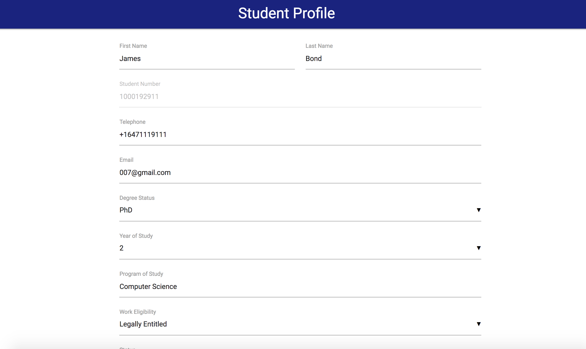
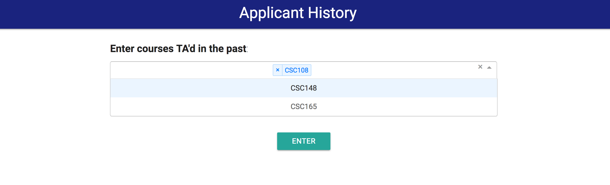
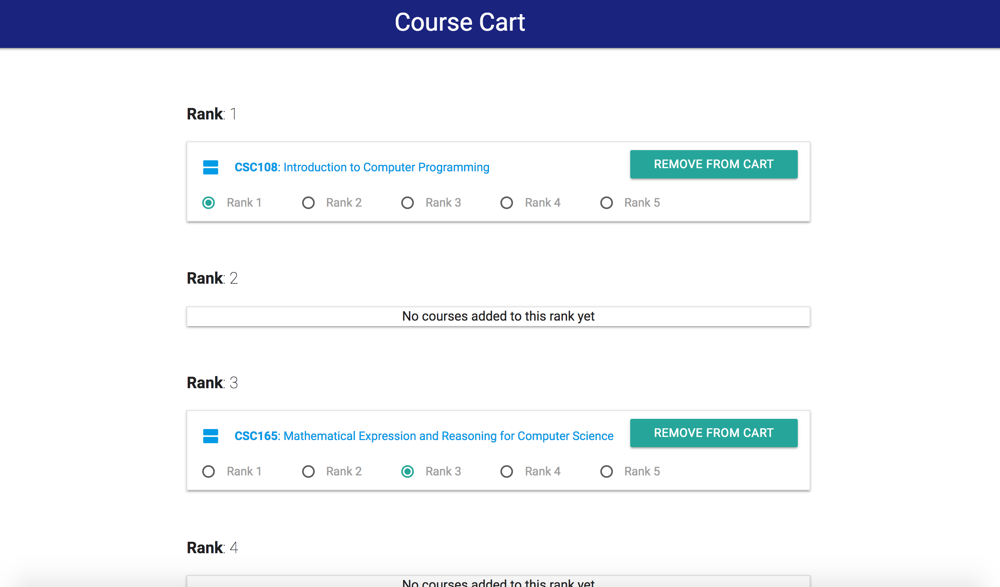
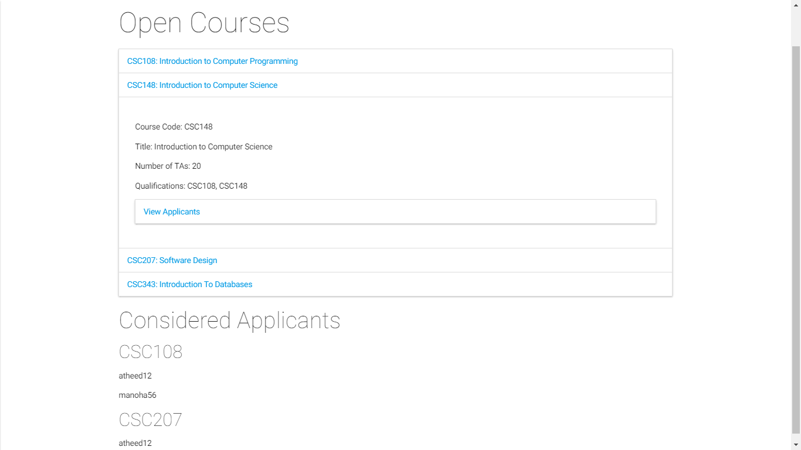
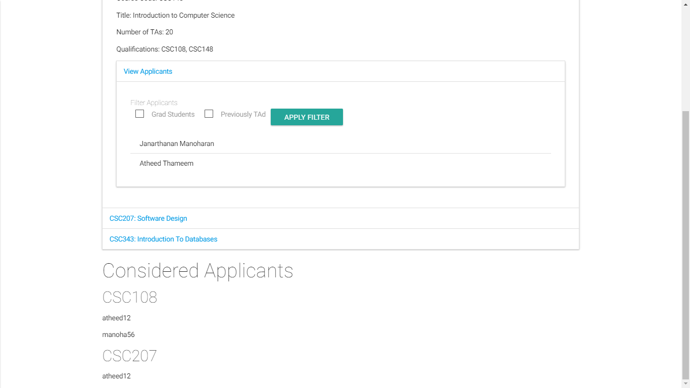
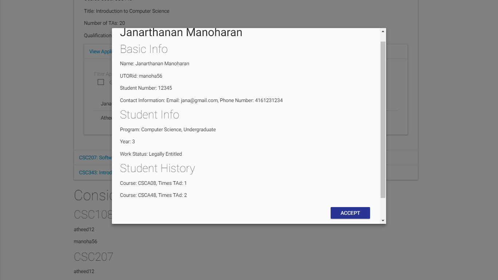

# Progress Report

### Intial Scope

Phase 2 was planned as our core developement phase. During this cycle, we planned to implement the base framework of our application that will enable us to build the features we mentioned in our initial [scope document](https://github.com/csc302-2017-spring/proj-TopOfTheHeap/blob/master/doc/phase1/Scope.md) in the previous phase. This includes setting up the projects and the dev environment for the different components of our app, designing and implementing the data model, and incorporating any new APIs that would be required by the client applications. In addition, we planned (and implemented) a sizeable subset of the features as mentioned in detail below.

### Tasks Completed
A significant portion of our entire application has been implemented during this phase. Apart from setting up the basic structures of the different components, we were able to implement the following set of features into our app:

* Applicant client:
    * User authentication
    * View list of courses with open TA positions
    * Mark courses interested in TAing, and rank them based on level of interest / preference
    * Ability to enter personal and academic information
    * Ability to add courses to a virtual cart, and revisit them with ease at a later time
    * Ability to save an incomplete application and resume editing at a later time

* TA Coordinator client:
    * View list of courses with open TA positions
    * View a list of applicants that applied to each course by clicking each course
    * Filter applicants based on their program level(Graduate Studies or Undergraduate)
    * Filter applicants based on whether they have TA'ed the course under consideration before
    * Ability to view an applicant's information such as their contact information, work status and work history
    * Ability to review all the assignments that have been made for each course

* Applicant System Backend:
    * [Design and implementation of database schema](https://github.com/csc302-2017-spring/proj-TopOfTheHeap/issues/22)
    * Following web APIs to support the above features of the Applicant and the TA Coordinator client:
   
     [Applicant Login](https://github.com/csc302-2017-spring/proj-TopOfTheHeap/issues/21), [GetAllApplicants](https://github.com/csc302-2017-spring/proj-TopOfTheHeap/issues/23), [GetCourses](https://github.com/csc302-2017-spring/proj-TopOfTheHeap/issues/30), [GetCourseInfo](https://github.com/csc302-2017-spring/proj-TopOfTheHeap/issues/31), [GetUnassignedPositions](https://github.com/csc302-2017-spring/proj-TopOfTheHeap/issues/38), [GetApplicantsByCourse](https://github.com/csc302-2017-spring/proj-TopOfTheHeap/issues/39), [GetApplicantProfile](https://github.com/csc302-2017-spring/proj-TopOfTheHeap/issues/53), [AssignApplicant](https://github.com/csc302-2017-spring/proj-TopOfTheHeap/issues/68), [FilterApplicants](https://github.com/csc302-2017-spring/proj-TopOfTheHeap/issues/82)
     
### Pending / Incomplete Tasks
Although we made significant inroads towards our final product, there are still outstanding features and some integration work left which we would have liked to complete within this phase. These are as follows:

* [API for saving applicant profile](https://github.com/csc302-2017-spring/proj-TopOfTheHeap/issues/52). This is only relevant for the non-academic information such as students' emails, degree status, etc, and their past history of TAing. This is *distinct* from the actual application for courses for TAing.
* [Apply consistent and usable design to all UI layouts](https://github.com/csc302-2017-spring/proj-TopOfTheHeap/issues/36)
* [Ability to mark an application as 'submitted'](https://github.com/csc302-2017-spring/proj-TopOfTheHeap/issues/75)

Furthermore, there are some tasks (from our initial scope document) which we planned to only tackle in the next phase, and are on target to tackle those. These are: 
* The ability for instructors to enter requests, and anti-requests. 
* The ability for the TA coordinator to get a named set of provisional applicants. This will likely be done as, perhaps, an auto-generated CSV file, or a spreadsheet.
* The ability to correctly filter and search for applicants (on the TA Coordinator client) by various fields.

### Task(s) Not Part of Initial Scope
There is a particular enhancement that we added to our feature list, as we think this will add value to the user experience and will make the application process more comfortable and seemless.

* We introduced the concept of a "virtual cart", which will allow applicants to mark / shortlist courses they are interested in applying, so that can access / revisit them with ease at a later time.

### Task(s) Removed from Scope
During this phase, some tasks (which were in our initial scope document) were removed from the scope of our project. 

1. We decided to remove the field for an Applicant to enter the past courses they have taken which are relevant to the TA position. This decision was taken for a couple of reasons. First, each Applicant makes one application for *all* the courses they desire, not on a separate application for each course; as such, courses relevant to *each* position is untenable. Additionally, we also made this decision because most Applicants apply for several TA positions (a rough average might be in the ballpark of 15 courses). As such, if an Applicant was to enter every course they had taken which was relevant to those positions, they would likely end up entering almost all of the past Computer Science courses they have taken. This seems both unnecessary and excessive, and will only complicate the process for both Applicant and TA Coordinator, without providing much utility. As such, we decided to remove this from our scope.

# High-level Design
As mentioned in our [architecture document](../phase1/Arch.md) in Phase 1, our entire application is partitioned into three separate components: two client apps (i.e. the Applicant and the TA-Coordinator apps) and one central backend system.

Each client app is only responsible for providing an interface to its respective users. These applications do not persist or modify any data by themselves. They only call out APIs provided by the central backend system to retrieve or update relevant data.

The central backend system is regarded as a container / wrapper around the database instance, and is responsible for providing  an interface / gateway between client applications and the database instance.

Moreover, in order to decouple the implementation logic and to be consistent with general best practices, we have created separate modules pertaining to specific types of operations within each of these applications. We believe, this greatly helped in keeping our codebase organized and readable.

**An Example API Call**

Here we will describe the general flow of an API call from the front-end to the back-end, in order to better illustrate how all 3 components (the Applicant client, the TA-Coordinator client, and the back-end) coordinate. 

Our front-end applications make liberal use of `fetch()` calls to retrieve data from the back-end and the database. For example, we retrieve the current logged-in user's Student Profile (in the `Profile.js` component) on the Applicant client. We do this by:

1.  First making a `fetch()` request (which is, in essence, [a JavaScript interface that allows one to hook into the HTTP pipeline](https://developer.mozilla.org/en-US/docs/Web/API/Fetch_API/Using_Fetch)) to the **Applicant client's `server.js` file** (which is the NodeJS server that is backing this React application -- every React application must have a backing server file). Note that this `fetch()` call is made to the client's own server, not to the main back-end server (that will happen in Step 3); this is done to provide maximum separation of concerns. 

2. Next, the Applicant client's `server.js` receives this request, parses the body/parameters of the request. 

3. Then, this `server.js` file makes a GET/POST request (based on what kind of `fetch()` request was made) to the main back-end server. 

4. The main back-end server (in `dev/services/src/main.js` and associated route files) receives this request, parses it, and retrieves the necessary information from the MongoDB database.

5. The main back-end server then sends an appropriate JSON response. 

6. This response is received by, once again, the Applicant client's `server.js` file. 

7. The Applicant client's server parses this response, and passes it on to the relevant front-end component that made this call (in this case, `Profile.js`). 

8. This front-end component receives this response, parses it, and uses this information to render the appropriate information on-screen.

This flow was used to ensure optimal separation of concerns. 

# Testing

For this phase, we relied largely on manual testing -- both on the front- and back-end. 

**Front-end**

For the front-end, as we built our various React components, we tested by visually asserting that each component rendered correctly, with the correct state variables, etc. We knew immediately, via this visual testing, when a component was rendering incorrectly, and could quickly and efficiently remedy the problem. We made liberal use of the various browsers' developer tools (for example [Chrome DevTools](https://developer.chrome.com/devtools)) in this testing process, to examine and debug any errors that occurred on the front-end. 

Additionally, our applications make frequent use of `fetch()` calls to various API routes in the back-end. For this, before actually calling any route, we ensured that all the data we intended to send was well-formed (using, for example, Chrome DevTools). Then, we ensured that each `fetch()` call arrived correctly at each application's respective `server.js` file (by logging the body of the requests). Then, only once all of this was ensured to be correct, did we make the final API call, from the corresponding `server.js` to the main back-end server (in `dev/services/src/main.js`). 

**Back-end**

In the back-end, we made constant use of API testers/examiners such as [Postman](https://www.getpostman.com/docs/introduction). Whenever an API route was built, we checked, using Postman, that 1) the route is actually alive and is receiving requests, 2) that the route is actually responding with well-formed JSON objects, and 3) that the route is responding with accurate and expected information. Any time that any of these 3 conditions was not met, we knew about it immediately through Postman, and were able to efficiently debug and fix the corresponding problem. 

**Next Phase**

For the next phase, we intend to formalise this testing workflow by implementing unit tests for every reasonable API route (with an appropriate amount of coverage), and then following a test-driven methodology. 

On the front-end, we will continue to use some visual testing, but will mix it in -- where possible -- with more formal testing workflows, such as [Jest](https://facebook.github.io/jest/docs/tutorial-react.html). 

# Technical Highlights

Throughout this phase, we encountered several interesting technical issues, challenges, and realizations. These ranged from relatively small and contained highlights, to large-scale highlights that impacted our overall application. Some of these highlights are described below: 

* Directly **typcasting a String to a Boolean will always result in true**. This was encountered while manipulating the state of a few React components (which relied on some Boolean-valued state variables), and their associated toggle functions. We found that mouseclick functions (and associated `event.target.value` values) cast actual Boolean values to their String representations). This took some time to debug, and provided an interesting small-scale technical challenge. 

* At various points, we found that we needed child components to be able to communicate with their parent components (and not just from parent-to-child). However, React -- with its unidirectional data flow -- can make this challenging. However, as w proceeded and investigated these problems, we learned that, in React, **functions themselves can be passed in as `props` (i.e. properties) to other components**. This realization allowed us to manage child and parent components concurrently and mock bi-directional data flow. This was crucial to various aspects of our project where child manipulations *necessarily* needed to impact the parent, from the Course Cart view to various components in the TA-Coordinator client.

* While trying to figure out ways to appropriately send (from the front-end to the back-end) information regarding an Applicant's Course Rankings/Preferences, we had trouble sending in an appropriate data structure. However, as we investigated this, we learned that, in React, one **can pass well-formed JSON objects in parameters in a GET/POST request**. This made it considerably easier to send an individual Applicant's course preferences, thus making it easier and more streamlined to implement the code flow for applying for a TAship.

* In our project, we use MongoDB as our backing database. As we continued using Mongo, we found out that the **in-built `document.save()` function could, both, create a new record *and* an update existing record** if given the `ObjectId`. This forced us to use the MongoDB-generated `id` instead of our own created `id`. This forced us to rewrite parts of the code to properly address the `id` issues. However, this also meant that, because we were using the MongoDB generating `id`, our applications ultimately became more stable and standard, as it abstracted away some complexity, and provided a standard way of uniquely identifying objects in the database object model.

* Because NodeJS is singed-threaded, we had to ensure that promises are completed, and only then execute other pieces of the code. We had issues when asynchronous code was running and generating different results that we didn't expect. Ultimately, we found that we **must wait for each promise to resolve/complete before moving on to the next portion of the handler code**.

* At one point, we encountered an interesting issue in macOS's default browser Safari, where none of the `fetch()` calls would work. After a great deal of debugging and testing, we found that **Safari is non-compliant with the Web standards with regards to JavaScript and the `fetch()` API**. As such, we had to import [an additional module](https://github.com/github/fetch) into our React applications to ensure that `fetch()` requests work in Safari. This showed us the importance of testing on all browser, and in the next phase we plan to ensure better cross-compatibility support.

* While building the Applicant client, we found that we sometimes needed to pass parameters not only into new sub-components, but also on to new pages that we would load (for example, when moving from Login page to the Profile page, we needed to pass in the Applicant's UTORid and Student Number, for further use and `fetch()` calls. However, React makes this challenging with its unidirectional data flow. After a lot of digging around, we found that using **`hashHistory` (from  [React Router](https://github.com/reacttraining/react-router)) to pass in additional properties to new pages** was the ideal solution. This gave us, and the application, more flexibility.

* Another interesting technical issue that was encountered was that, despite the NodeJS/Express function `res.status` (which allows one to pass in the HTTP response code -- e.g. 200, 404, etc.), it was difficult for React (and its backing Node servers) to parse this status. As such, we found that we needed to, **in addition to passing in the HTTP response code in `res.status`, we also needed to send a status success/failure and appropriate error message**, for easier parsing for React.

# Teamork and Process
We deviated quite a bit from initial plan of following Kanban as our development process. We adapted a more agile and less strict workflow, where we primarily collaborated through GitHub Issues and through online communication. Tasks, such as the implementation of features and APIs, were articulated as GitHub Issues and assigned to team members based on their expertise and / or the nature of work they were already involved with in this project.

### Source Code Managment
Although, the code bases for all the three components of our app was hosted within the same repository, we partitioned them neatly in separate directories, such that they still remained as self-contained entities without any direct dependencies within each other.

Despite this not being an extremely large project, with only a few developers working on each component, we used GitHub Pull Requests extensively as a means of ensuring that the code being pushed could safely be merged, and also to allow extra pairs of eyes when necessary. We occasionally made use of Reviews for Pull requests ([here](https://github.com/csc302-2017-spring/proj-TopOfTheHeap/pull/45) is an example), but generally gave the responsibility to each individual developer to ensure that they pushed non-breaking, stable, and error-free code. This was largely done through manual testing (as described in the Testing section of this document). We also made some use of GitHub branching, though this was largely on the front-end. In general, branching was not too necessary because of the compartmentalization of the project, and each developer's responsibilities being distinct.

### Meetings
We followed [previous patterns of meetings](https://github.com/csc302-2017-spring/proj-TopOfTheHeap/blob/master/doc/phase1/Collaborate.md), regularly meeting in tutorial time slots and discuss important issues and planning for next week. Other times, we used Facebook group chat to talk about design concerns and issues raised during development. Most of our members were very prompt and proactive in terms of responding to messages and getting tasks completed.

**Below are the notes for the meetings we held for this Phase 2**:

* #### March 10, 2017

  __Location__: On campus  
  __Attendees__: All team members  
  __What was accomplished__: We completed a post-mortem of our Phase 1 submission and grades, both amongst ourselves and with the TA. This helped us get feedback on the things we did right, and the things we could have improved on, which set us up well to have a good idea of the approach we should take for Phase 2. Additionally, we also divided up the work for Phase 2 amongst ourselves. We chose which team members would be working on the front-end and back-end (and made further subdivisions therein; for example, who would work on the Applicant client, who would work on the TA Coordinator client, who would work on the database, who would work on the NodeJS routes, etc.). We also decided on some of the most important, high-priority tasks, and which tasks were less important. We held discussions on which scope items to complete in this Phase, and which ones could be pushed to Phase 2; this was a fruitful discussion as the division was well-made, and as laid our in this document, we met most of the scope items we set out to meet. We also decided our general workflow of how we would collaborate as a team for Phase 2.

After the above meeting, we did not meet in person until the following week, so instead we communicated extensively through Facebook group chat. This allowed us to maintain an up-to-the-minute idea of the state of the project (and the various components therein). This was also where we ironed out a lot of issues, both large-scale design issues as well as technical issues. Several of the issues described in the Technical Highlights section of this document (for example, the MongoDB issues, the Safari bug, and the HTTP response code difficulty) were actually found out about and discussed on the group chat. Most of these issues were solved/remedied via the various group members' contributions in the group chat itself. 

As such, we did not need to meet as often as perhaps we expected, and nonetheless kept working at a steady and quick rate. The group chat, in addition to the GitHub issues, proved priceless in keeping us on-track and in regular communication with each other.

* #### March 17, 2017

  __Location__: On campus  
  __Attendees__: Everyone  
  __What was accomplished__: When we met at this point, large portions of the work for this Phase were already complete. As such, the front-end team demo'ed the parts of the clients that were complete and working, and got valuable feedback from the other team members. The front-end team also talked about the remaining features left to complete, and the timeline for these. The entire team also discussed whatever features were blocking each member (i.e. some front-end components required back-end API routes to be completed before they could be finished), and this gave us a good idea of what was left to be done. The back-end team described some of the additional challenges and upcoming API routes, so that the whole team could plan the required work for the weekend. Additionally, we also discussed how we would go about completing the report, and pieces that we were missing, or hadn't discussed. Ultimately, this gave us a really strong sense of the little remaining work, and how we would demo

* #### March 19, 2017

  __Location__: On campus  
  __Attendees__: Front-end team  
  __What was accomplished__: The front-end team met up to iron out some bugs that both Applicant and TA Coordinator clients were having, and discuss some unification of styling. This was a good meeting to bounce ideas off one another, and help each other fix some small, remaining bugs/issues. 

* #### March 20, 2017

  __Location__: On campus  
  __Attendees__: Front-end team  
  __What was accomplished__: In this meeting, final decisions on general styling/CSS were made, and were implemented. This meeting was done to ensure that both clients look roughly similar, and that they both have a fluid, usable feel to them. This meeting also helped us get a better sense of the flow of the demo. 

### Rate of Progress
As reflected from the timestamps in our [GitHub Issues](https://github.com/csc302-2017-spring/proj-TopOfTheHeap/issues?q=is%3Aissue+is%3Aclosed) and the [commit history](https://github.com/csc302-2017-spring/proj-TopOfTheHeap/commits/master), we did not get started with development work from day one of this phase. We took a bit of time and got started with development work a week later. However, as it can be seen from the number of *closed* issues and the product that we will be demoing, we did make very quick and steady progress over the past couple of weeks and have reached a state where we consider that most of the implementation work has been completed.

## Areas of Improvement and Plans for Next Phase
Although our way of working and collaboration worked out pretty well for the most part, we do think there are areas of improvement, particularly in planning and work allocation. Firstly, we haven't referred much to the API document we created in phase 1. This has led to some reiteration and duplication of work, and has consumed some valueable time resource. Secondly, we think we should have been more specific and granular when assigning targets to team members. We consider that we were a bit too general when assigning work, and as a result there was a lesser scope of accountability.

Going forward into the final phase, we will consider making tasks more granular and specific. However, as we judge based on our initial [scope document](../phase1/Scope.md) and the above list pending tasks, there isn't much development work left to reach a state where will be comfortable taking our product for a test-drive.

# Workflow and Progress Artifacts

### Completed Tasks:

### Pending Tasks:

### Applicant Client UI:

### TA Coordinator Client UI

